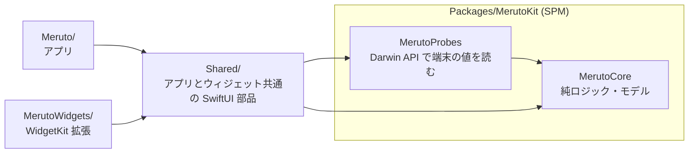

# Meruto アーキテクチャ

## 1. 層とターゲット



| 場所 | 置くもの | 置かないもの |
|---|---|---|
| `MerutoCore` | リングバッファ、CPU tick の差分、32bit カウンタの一周処理、書式 (`Format`)、しきい値 (`Severity`)、Wi-Fi リンク品質スコア (`LinkQuality`)、電波マップと IDW 補間 (`Survey`)、AgentQuota のモデルとデコード、App Group (`SharedContainer`) | UIKit / SwiftUI / OS の値の読み取り |
| `MerutoProbes` | `CPUProbe` (host_processor_info)、`MemoryProbe` (host_statistics64)、`NetworkProbe` (getifaddrs)、`GatewayResolver` (sysctl のルーティングテーブル)、`ICMPPinger` (非特権 ICMP)、`SystemInfo` / `StorageUsage` | 画面の状態、しきい値の判断 |
| `Shared/` | `SharedAssets.xcassets` (AI プロバイダーのアイコン、AccentColor)、`Theme`、ゲージ (`RingGauge` / `ArcMeter` / `Sparkline` / `SegmentBar` / `SignalBars`)、AgentQuota のゲージ部品、`HeatmapRenderer`、`QuotaClient`、`WidgetKinds` | アプリだけで使う画面 |
| `Meruto/` | アプリの画面と、画面が持つ状態 (`@Observable` のモデル) | ウィジェットから使う部品 |
| `MerutoWidgets/` | 3 種のウィジェットの TimelineProvider と View | |

`MerutoCore` と `MerutoProbes` は macOS でもビルドできるので、`swift test` でロジックとプローブを検証できる (`./script/build.sh --test`)。

## 2. アプリのフォルダ構成

```
Meruto/
  App/           MerutoApp (モデルの生成と受け渡し), RootView (タブとディープリンク)
  Components/    画面をまたいで使う部品: Panel, Readout, LiveBadge, ScreenTitle
  Dashboard/
    DashboardView.swift   カードの並び (iPhone は 1 列、iPad は 2 列)
    Cards/                ホームの各カード。1 カード 1 ファイル (XxxCard)
    Model/                DeviceMonitor (1 秒ごとのサンプリング), GPUInfo, FPSCounter
  WiFi/
    Model/   WiFiMeter (ICMP 測定), SurveyStore (マップ保存), SurveyRecorder (記録), ARPositionTracker, HapticGeiger
    Views/   WiFiScreen と各パネル (MeterPanel, ScopePanel, SurveyPanel, SurveyMapView, ...)
  AIQuota/
    Model/   AgentQuotaStore (agent-quota の取得・15 秒ポーリング)
    Views/   AIQuotaScreen, AgentQuotaHomeCard (SuperNotch 移植), ProviderDetailPanel
  Settings/  SettingsView
  Resources/ Info.plist, entitlements, Assets.xcassets (アプリ専用: AppIcon, LaunchBackground)
```

命名: ホームのカードは `XxxCard`、1 画面の中の区画は `XxxPanel`、画面全体は `XxxScreen` / `XxxView`。

## 3. データの流れ

| モデル | 周期 | 動く条件 | 読むもの |
|---|---|---|---|
| `DeviceMonitor` | 1 秒 (ping は 2 秒) | アプリがアクティブな間 (`RootView` が scenePhase で制御) | CPU・メモリ・通信量・電池・熱状態、5 秒ごとにストレージ・IP・無線方式 |
| `WiFiMeter` | 約 6 回/秒 | Wi-Fi 画面が表示中 (`acquire` / `release` の参照カウント) | ゲートウェイへの ICMP、5 秒ごとに SSID/BSSID |
| `AgentQuotaStore` | 15 秒 | AI カードか AI 画面が表示中 (`setVisible` の参照カウント) | `GET {baseURL}/api/v1/quota` |

- 履歴は各モデルが `RingBuffer` で持つ (`DeviceMonitor.historyLength` = 90 点 = 90 秒)。
- ウィジェットへの受け渡しは App Group (`SharedContainer`) のファイル:
  - `device-snapshot.json` … `DeviceMonitor.persistSnapshot` が 30 秒ごとと、バックグラウンド移行時に書く
  - `agent-quota.json` … `QuotaClient` が取得に成功するたびに書く (ウィジェット自身も取得する)
  - `surveys.json` … `SurveyStore` が書く
- ウィジェットは自分で読める値 (CPU・メモリ・ストレージ・電池・AI 使用量) は拡張の中で読み、Wi-Fi の品質だけアプリのスナップショットを使う (ローカルネットワークの許可はアプリにしか付かないため)。

## 4. 詳細画面の追加手順 (予定)

ホームのカードを押したときの詳細画面は、次の形で足す。

1. **ルートを定義する**。`Dashboard/DashboardRoute.swift` に行き先を列挙する。

   ```swift
   enum DashboardRoute: Hashable {
       case cpu, memory, gpu, network, battery, thermal, storage
   }
   ```

2. **ナビゲーションを張る**。`DashboardView` の `ScrollView` を `NavigationStack` で包み、`.navigationDestination(for: DashboardRoute.self)` で詳細画面へ振り分ける。Wi-Fi と AI のカードは既存のタブへ移る (`onOpenWiFi` / `onOpenAI`) ので、ルートには入れない。

3. **カードを押せるようにする**。カードを `NavigationLink(value: DashboardRoute.cpu) { CPUCard(monitor: monitor) }.buttonStyle(.plain)` で包む。カード自身には遷移の知識を持たせない。

4. **詳細画面を置く**。`Dashboard/Details/CPUDetailView.swift` のように 1 画面 1 ファイル。背景は `InstrumentBackground()`、見出しは `ScreenTitle`、区画は `Panel` を使う。

5. **足りないデータはモデルに足す**。
   - 長い履歴が要るときは、`DeviceMonitor` に詳細用の `RingBuffer` を足す (例: 10 分 = 600 点)。表示中だけ溜めたいなら `WiFiMeter` と同じ参照カウント方式にする。
   - 新しく OS から読む値は `MerutoProbes` にプローブとして足し、判定や書式は `MerutoCore` に足してテストを書く。

6. **確認**: `./script/build.sh --test` → `./script/build.sh` → シミュレータで iPhone と iPad (regular 幅の 2 列レイアウト) の両方を見る。

## 5. Wi-Fi 測定の仕組み

iOS はアプリに RSSI / dBm を公開していない。`WiFiMeter` は既定ゲートウェイへ Wi-Fi インターフェイスに束縛した ICMP Echo (`IP_BOUND_IF`) を約 6 回/秒送り、`LinkQualityAnalyzer` が直近の窓から次を出す。

- RTT の中央値、ジッタ (連続 RTT 差の平均)、ロス率 → `LinkQuality.score` で 0–100
- 56B と 1400B の RTT 差 → 無線区間の実効レート推定

電波マップは `ARPositionTracker` (ARKit のワールドトラッキング) の床面位置で 0.35m ごとに点を記録し、`HeatmapBuilder` の逆距離加重で補間する。測定点から 0.9m までは不透明、2.4m で透明 (測っていない場所を推測で塗らない)。

シミュレータでは Mac の物理 IF (en*) の既定経路を測る (`WiFiMeter.resolveTarget`)。

## 6. 落とし穴

- **Swift 6 の並行性**: モデルは `@MainActor @Observable`。WidgetKit の completion は Sendable でないので `CompletionBox` で包んで Task に渡す。ARKit のデリゲートは別スレッドから毎フレーム呼ばれるので、ロック付きの `LatestFrame` に最新値だけを置く。
- **App Group が無い署名**: `SharedContainer` はアプリの Application Support に退避する。アプリは動くが、ウィジェットへ測定値を渡せない。
- **ウィジェットの更新**: OS の裁量 (概ね 15–30 分)。即時性はアプリ側で担保し、`WidgetCenter.reloadTimelines` は要求にすぎない。
- **アセットの置き場所**: アプリとウィジェットの両方で使う画像・色は `Shared/SharedAssets.xcassets` に置く。XcodeGen はターゲットの `sources` に含まれるカタログだけを同梱し、`resources:` というキーは無い (以前これでウィジェットにアイコンが入っていなかった)。
- **ブランドアイコン**: `Assets.xcassets/AgentIcons` の SVG は `width/height="1em"` だとアセットコンパイラが扱えないので数値にしてある。Z.ai の `currentColor` は `#5BA8FF` に置換済み。
